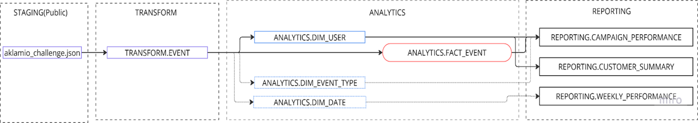

# Quick Start
All data models and tests
- [DBT Models](models)

- Execution  
 -> Download & install Docker Desktop (if not already installed) using the official website.
 -> Clone this repo https://github.com/marzooqe/project_aklamio to your device.
<pre><code>git clone https://github.com/marzooqe/project_aklamio
</code></pre>
-> Note: The repository includes docker container with postgres and dbt setup along with raw json data.
-> Execute the complete setup by the command
<pre><code>docker compose run up -d
docker compose run --rm dbt build
docker compose run --rm dbt test
</code></pre>
-> The complete setup is build having data loaded to 3 layer architecture. The data is ready in reporting layer for analysis and to start with the SQL queries in the [analyses](analyses) folder will answer the business question asked.
-> Download [Dbeaver](https://dbeaver.io/download/) for running sql queries to explore the modeled data/verify the SQL codes. The credentials 
<pre><code>
   "Host": "localhost"
   "User": "dbt_user"
   "Password": "dbt_password"
   "Port": "5432" 
</code></pre>

# Project Aklamio
 This project implements ETL workflow using dbt, architecting raw json events data into data model and actionable business insights.

### 🧭 Overview
This project simulates a modern data stack that is organised,clean, scalable which addresses data queries from analytics. It includes:
✅ Raw data ingestion from Excel files using shell script
📂 Data architecture and modeling concept
🏗️ Data transformation into layers in dbt:
TRANSFORM (cleaned and basic transformation from staging layer)
ANALYTICS (well-defined star dimensional models)
REPORTING (business focused OBT)
🔍 Data testing, linting, and CI/CD

### ⚙️ Prerequisites
1. Docker Desktop 
2. Dbeaver 
### 📂 Project Structure  
    dbt_enpal_assessment/  
    ├── models/  
    │   ├── transform/       # Cleaned transformed data  
    │   ├── analytics/       # Dimensional models (DIM_) & Fact tables(FACT_)  
    │   ├── reportinf/       # Combined OBT tables, metrics  
    ├── seeds/               # for seed files    
    ├── raw_data/            # folder for repeated raw data input 
    ├── tests/               # custom test cases for data quality
    ├── macros/              # Custom dbt macros
    ├── .sqlfluff            # Linting configuration  
    ├── docker-compose.yml   # docker entities configuration
    ├── init_scripts         # initiation tables import for the raw json file
    ├── dbt_project.yml      # Project metadata  
    └── README.md            # 📄 You're here!  

### 🚀 Execution Guide     
Work flow overview
The complete execution is chained to sequentially trigger starting from docker compose. The init.sql imports from raw json file in the repository and loads to default schema public. Then triggers executed dbt codes creating the schemas and respective tables. Followed by this dbt test can be executed veryfying the data. Finally the data is available in reporting schema.

The execution steps can be found in the quick start section on top.

### 🧱 Data Model / Architecture

The diagram represents data flow and the architecure design of the model. The data is modeled based on star dimensional methodology and mainly comprises Fact and Dimension tables at the core of it.
The staging layer(public shema) mirrors the raw source data without transformations or business logic and it is designed as the fallback data source for uncorrupted raw data without BI intervention. This supports tracing debugging data issues and retro correction if needed.

Transformation Layer:
This layer focuses on transformation of data to flat, filtered, and data type corrected structure. The lager tables can be set to have incremental load on scaling.

Analytics Layer:
This schema holds the star dimensional model. As seen in the above diagram the central fact table is the core that contains the the metrics and the foreign keys to the related dimension tables. This methedology is what drives scalablity, optimised performance, denormalisation and accessibility. 

Reporting Layer
This layer extracts facts and dims to OBTs to be directly used in a BI tool, optimised for end users. This layer will be fully defined by business use cases and will have the pre-aggregations, so that the load in a BI visualisation tool is minimal. This layer is used by analyst for data to day request.

Similarly majority of the modeling steps are done keeping in mind future scope of the DwH. Although all the architectural implementation might not be needed now it is for the scalability factor the setup is made in ideal format. 

### 🧪 Testing & Quality Checks
Implemented using: schema.yml-based tests in each shema(not_null, unique, etc.)

### 📤 Output / Results
After successful dbt build, the Postgres DB will contain:
🚀 Clean tables ready for analysis structured in organised schemas
✅ Validated and type-checked data
🧾 Pre-joined reporting table
📚 Documentation (dbt docs generate + dbt docs serve)
